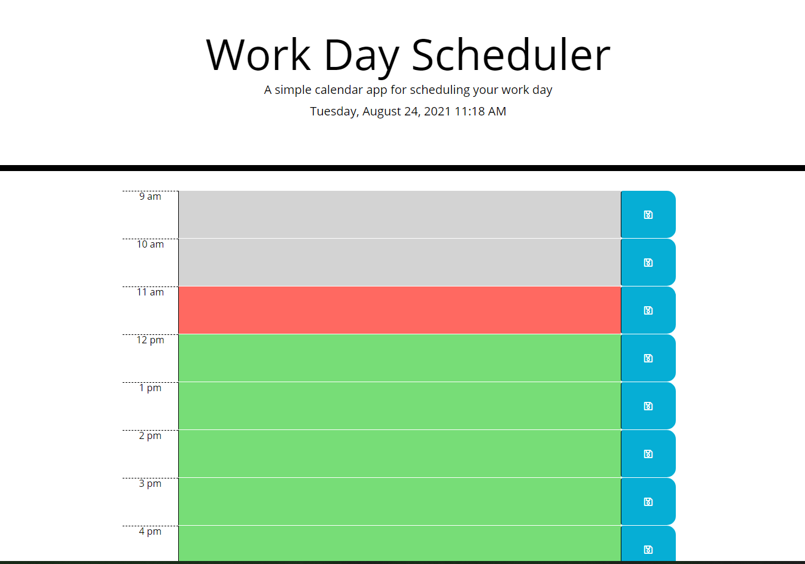

# Day Planner

This app allows you to track your tasks throughout the day. 

## Link to Pages

[Day Planner](https://tevissaur.github.io/daylight-radar)

## How to use this app

1. Enter in task you want to complete at each hour
2. Press the save button to the right of the time block 
3. Stay focused!

## Features

- UI indicates whether or not the time block is past, present or future
- Saves tasks into local storage so that you can keep coming back to it

## Screencap

